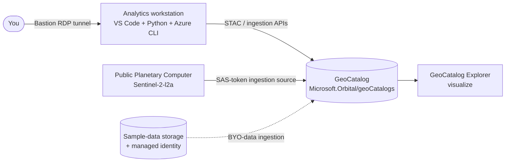

# Microsoft Planetary Computer Pro Rapid POC

A configurable rapid POC that stands up a **Microsoft Planetary Computer Pro GeoCatalog**
and proves the end-to-end **ingest → configure → visualize** flow with a single
**Deploy to Azure** button. Choose the complete environment or only the components you need:

- a **GeoCatalog** (the Planetary Computer Pro resource that stores, indexes, and serves
  your geospatial data using the open [STAC](https://learn.microsoft.com/azure/planetary-computer/stac-overview) standard),
- an optional **analytics workstation** (a Windows VM with Visual Studio Code, Python, and
  the Azure CLI) that runs an automated sample which creates a STAC collection, ingests
  sample Sentinel-2 imagery, and configures it for visualization, and
- an optional **sample-data storage account + user-assigned managed identity** for the
  secure managed-identity ingestion path (bring your own data).

The workstation is network-isolated and reached privately over **Azure Bastion** — no
public RDP port. No custom platform logic runs here; the GeoCatalog does the work, and
this repo just stands up the environment and drives the documented APIs for you.

> **Scope:** this POC deploys the GeoCatalog and demonstrates ingesting a small set of
> **sample** Sentinel-2 scenes from the public Planetary Computer. It is a proof of
> concept, not a production landing zone.

## Logical architecture

The GeoCatalog is the top-level container for geospatial data. The analytics workstation
runs Visual Studio Code and Python inside the virtual network; users connect through Azure
Bastion, and direct inbound RDP is blocked. From the workstation, the sample script signs
in with the Azure CLI, creates a STAC collection in the GeoCatalog, registers the public
Planetary Computer container as a SAS-token ingestion source, ingests sample imagery, and
applies render + mosaic configuration so the collection is visible in the GeoCatalog
Explorer. The optional storage account and managed identity support the alternative
managed-identity ingestion path for your own data.



## Prerequisites: resource providers

| Provider | Used for |
| --- | --- |
| `Microsoft.Orbital` | The Planetary Computer Pro GeoCatalog |
| `Microsoft.Compute` | The analytics workstation VM |
| `Microsoft.Network` | VNet, NSG, public IP, NIC, Bastion |
| `Microsoft.Storage` | Sample-data storage account |
| `Microsoft.ManagedIdentity` | Ingestion managed identity |

Register `Microsoft.Orbital` before deploying (the portal auto-registers the others during
validation):

```bash
# Azure CLI
az provider register --namespace Microsoft.Orbital
```

```powershell
# PowerShell
Register-AzResourceProvider -ProviderNamespace Microsoft.Orbital
```

> **Preview regions:** GeoCatalog is available in **East US, North Central US, West Europe,
> Canada Central, UK South**, and US Gov Virginia. Deploy into one of these regions.

## Deploy to Azure

Click the button, sign in to the Azure portal, choose your components (GeoCatalog is always
deployed; add the workstation and/or sample storage), set the administrator credentials for
the workstation, and select **Review + create**.

[](https://portal.azure.com/#create/Microsoft.Template/uri/https%3A%2F%2Fraw.githubusercontent.com%2FBalunywa%2Fplanetary-computer-pro-poc%2Fmain%2Fdeploy%2Fazure%2Fazuredeploy.json/createUIDefinitionUri/https%3A%2F%2Fraw.githubusercontent.com%2FBalunywa%2Fplanetary-computer-pro-poc%2Fmain%2Fdeploy%2Fazure%2FcreateUiDefinition.json)

[Visualize](http://armviz.io/#/?load=https%3A%2F%2Fraw.githubusercontent.com%2FBalunywa%2Fplanetary-computer-pro-poc%2Fmain%2Fdeploy%2Fazure%2Fazuredeploy.json)

> A GeoCatalog deployment can take **10 or more minutes** (occasionally longer). The
> deployment status may show "Created" before the resource is fully ready.

## Deploy from the command line (optional)

```bash
az group create -n pcpro-poc-rg -l westeurope

az deployment group create -g pcpro-poc-rg -f deploy/azure/main.bicep \
  -p adminUsername=azureuser \
     adminPassword='<strong-password>'
```

To deploy only the GeoCatalog (no workstation, no storage):

```bash
az deployment group create -g pcpro-poc-rg -f deploy/azure/main.bicep \
  -p deployWorkstation=false deploySampleStorage=false
```

The deployment outputs `geoCatalogName`, `geoCatalogResourceId`, `workstationName`,
`bastionName`, `sampleStorageAccount`, `sampleContainer`, and `ingestIdentityClientId`.

## Grant yourself access to the GeoCatalog

Data-plane operations (creating collections, ingesting, visualizing) require a
**GeoCatalog Administrator** role assignment on the GeoCatalog resource:

```bash
az role assignment create \
  --assignee "<your-object-id-or-upn>" \
  --role "GeoCatalog Administrator" \
  --scope "$(az resource show -g pcpro-poc-rg -n <geoCatalogName> \
              --namespace Microsoft.Orbital --resource-type geoCatalogs --query id -o tsv)"
```

## Run the sample (ingest → configure → visualize)

The sample runs on the workstation because it drives the GeoCatalog data-plane APIs with
your signed-in identity.

1. Open the workstation page in the portal → **Connect → Connect via Bastion** (or use the
   Bastion RDP tunnel). Direct public RDP is blocked.
2. On the workstation desktop, open **connection-info.txt** for the GeoCatalog name and the
   exact commands.
3. Copy the **GeoCatalog URI** from the portal: your GeoCatalog resource → **Overview →
   GeoCatalog URI**.
4. In a terminal on the workstation:

   ```powershell
   az login
   python "C:\Users\Public\Desktop\ingest_sample.py" --geocatalog-url "<GEOCATALOG_URI>"
   ```

   The script creates a STAC collection, registers the public Planetary Computer container
   as a SAS-token ingestion source, ingests sample Sentinel-2 scenes over southern Iceland,
   and applies render + mosaic configuration.
5. Open the **Explorer** at `<GEOCATALOG_URI>/collections` to visualize the imagery.

You can also run [`deploy/azure/ingest_sample.py`](deploy/azure/ingest_sample.py) from any
machine that has `az login`, Python 3.10+, and the packages
`pystac-client azure-identity requests pillow`.

## Use your own data (managed-identity ingestion)

When you deploy the sample storage component, the template also creates a user-assigned
managed identity (`pcpro-ingest-identity`) with **Storage Blob Data Reader** on the sample
container. To ingest your own assets:

1. Upload your COGs / rasters and their STAC items to the `sample-assets` container in the
   deployed storage account.
2. Assign the ingestion managed identity to the GeoCatalog and register a managed-identity
   ingestion source pointing at the container. See
   [Set up an ingestion source using managed identity](https://learn.microsoft.com/azure/planetary-computer/set-up-ingestion-credentials-managed-identity).
3. Post your STAC items to the GeoCatalog Items API (the same pattern the sample uses).

## What's in this repo

| Path | Purpose |
| --- | --- |
| `deploy/azure/main.bicep` | Bicep source — provisions the GeoCatalog, optional workstation (VNet/NSG/Bastion), and optional sample storage + ingestion identity |
| `deploy/azure/azuredeploy.json` | Compiled ARM template behind the **Deploy to Azure** button |
| `deploy/azure/createUiDefinition.json` | Portal form for the one-click deployment (component selection + credentials) |
| `deploy/azure/setup.ps1` | Run by an Azure VM Run Command — installs Python, Azure CLI, VS Code, and the sample script on the workstation |
| `deploy/azure/ingest_sample.py` | End-to-end sample: create STAC collection, ingest sample Sentinel-2 imagery, configure render + mosaic for visualization |
| `deploy/azure/teardown.sh` | Deletes the resource group and everything in it |

## Security

- **RDP only, via an Azure Bastion tunnel** — no SSH, no public RDP port; the workstation
  NSG has no inbound rules.
- The workstation uses a **system-assigned managed identity**; the sample-data storage is
  reached by a **user-assigned managed identity** scoped to **Storage Blob Data Reader** on
  the sample container only.
- The workstation admin password is a `@secure()` deploy-time parameter (not stored in the
  template) and can be rotated with `az vm run-command`.
- The sample script signs in interactively (`az login`) and never writes tokens to disk;
  `connection-info.txt` contains no secrets.
- GeoCatalog data-plane access is governed by Azure RBAC (**GeoCatalog Administrator** /
  **GeoCatalog Reader**). Grant least privilege.

## Tear down

Delete the resource group to remove everything (GeoCatalog, workstation, storage, and all
ingested data):

```bash
./deploy/azure/teardown.sh pcpro-poc-rg
```

Equivalent one-liner:

```bash
az group delete -n pcpro-poc-rg --yes
```

## References

- [Microsoft Planetary Computer Pro documentation](https://learn.microsoft.com/azure/planetary-computer/)
- [Deploy a GeoCatalog resource](https://learn.microsoft.com/azure/planetary-computer/deploy-geocatalog-resource)
- [Use the APIs to ingest and visualize data](https://learn.microsoft.com/azure/planetary-computer/api-tutorial)
- [Manage access](https://learn.microsoft.com/azure/planetary-computer/manage-access)
