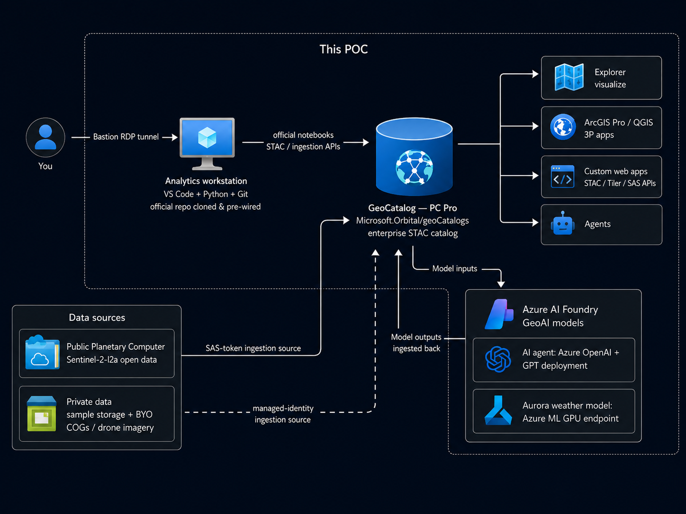
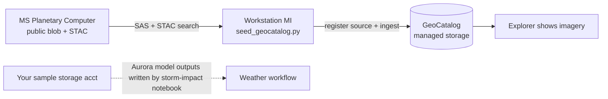
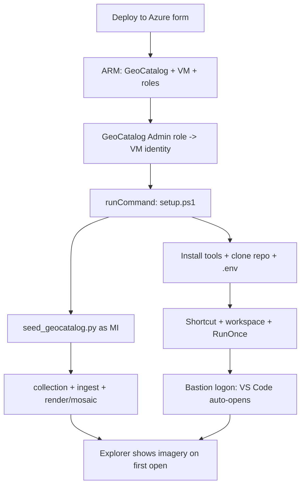

# Microsoft Planetary Computer Pro Rapid POC

A **turnkey Azure environment** that stands up everything the official
[Microsoft Planetary Computer Pro](https://github.com/Azure/microsoft-planetary-computer-pro)
samples assume you already have a **GeoCatalog**, a secure analytics workstation, sample
storage, and a scoped managed identity, with a single **Deploy to Azure** button, and then
**clones the official repository onto the workstation and pre-wires it** so an engineer can
open Microsoft's notebooks and run them immediately.

The official repo is *code* (notebooks, the Aurora storm-impact app, tools, and the GeoAI
SDK). Its own quick-start still expects you to bring a deployed GeoCatalog, blob storage,
identities, networking, and a hand-edited `.env`. **This repo provides exactly those
pieces**, the landing zone so you don't hand-build them for every POC.

What the button deploys (pick the complete environment or only what you need):

- a **GeoCatalog** (the Planetary Computer Pro resource that stores, indexes, and serves
  your geospatial data using the open [STAC](https://learn.microsoft.com/azure/planetary-computer/stac-overview) standard),
- an optional **analytics workstation** (a Windows VM with Visual Studio Code, Python, Git,
  and the Azure CLI) that **clones the official repo**, installs its dependencies and the
  Planetary Computer Pro SDK, and pre-fills the environment so the notebooks are ready to
  run, and
- an optional **sample-data storage account + user-assigned managed identity** for the
  secure managed-identity ingestion path (bring your own data),
- an optional **AI agent**, an **Azure OpenAI (Microsoft Foundry)** account + GPT model
  deployment (`gpt-5-mini` by default) for agentic / reasoning GeoAI scenarios against the
  GeoCatalog, key-less via managed identity, and
- an optional **Aurora weather model** on a **Foundry (Azure ML) GPU managed-compute
  endpoint**. The workspace + endpoint always deploy with this component; the GPU model
  deployment only runs when you supply a model asset ID and have A100 quota + accepted
  marketplace terms (so a default deploy never hard-fails on quota).

The workstation is network-isolated and reached privately over **Azure Bastion**, with no
public RDP port. This repo deploys and wires the environment; the actual ingest / configure
/ visualize / GeoAI logic is Microsoft's official code, unchanged.

> **Primary scenario — weather for energy / oil & gas.** This POC is aimed at the
> **weather** use case: predicting a tropical storm's path with the **Aurora** AI weather
> model and assessing its impact on **energy / oil & gas infrastructure** (offshore
> platforms, refineries, pipelines, the power grid). The headline workflow is Microsoft's
> `applications/storm_impact_assessment/hurricane_forecast_infra_impact.ipynb`
> (storm select → ECMWF via Planetary Computer Pro → Aurora inference on a Foundry GPU →
> model outputs to your storage → infrastructure-impact map). The workstation opens on this
> notebook first; the optical STAC tutorial is included as a quick proof that the
> ingest → render → visualize pipeline works.

> **Scope:** this POC provisions the environment and clones Microsoft's official samples.
> The introductory notebooks (STAC ingest + visualization of sample Sentinel-2 imagery) run
> out of the box. **You do not need the Aurora weather model to test the POC end to end** —
> deploy the GeoCatalog + analytics workstation (+ sample storage/identity, AI agent optional)
> and run the intro notebooks (create a STAC collection → ingest sample Sentinel-2 imagery →
> apply render/mosaic config → view it in the GeoCatalog Explorer) for a full end-to-end run.
> Aurora is only required for the advanced Aurora storm-impact app. The advanced Aurora storm-impact app needs the **Aurora** model on a
> Foundry **GPU** endpoint (`Standard_NC24ads_A100_v4`): select the **Aurora weather model**
> component to provision the Foundry workspace + endpoint, then supply a model asset ID (the
> official app uses `azureml://registries/azureml/models/Aurora/versions/4`) and have GPU
> quota + accepted marketplace terms to deploy the model. See
> [Where Azure AI Foundry fits](#where-azure-ai-foundry-fits).

> **Already superset of the storm app's own template.** The official repo ships a minimal
> `applications/storm_impact_assessment/deploy/azuredeploy.json` (GeoCatalog + storage + AI
> Foundry + Aurora endpoint). This template provisions **all of that plus** the workstation,
> networking/Bastion, managed-identity ingestion, and a pre-wired `.env`, so **don't run both** —
> deploying this one already stands up everything the storm-impact notebook needs.

## Logical architecture

The GeoCatalog is the top-level container for geospatial data. The analytics workstation
runs Visual Studio Code and Python inside the virtual network; users connect through Azure
Bastion, and direct inbound RDP is blocked. At deploy time the workstation clones the
official Microsoft Planetary Computer Pro repository, installs its dependencies plus the
Planetary Computer Pro SDK, and writes a pre-filled environment. From there an engineer
signs in with the Azure CLI and runs Microsoft's official notebooks, creating a STAC
collection, ingesting sample Sentinel-2 imagery, and applying render + mosaic configuration
so the collection is visible in the GeoCatalog Explorer. The optional storage account and
managed identity support the managed-identity ingestion path for your own data.

This mirrors the Planetary Computer Pro reference architecture: public + private data
flow into the GeoCatalog (the enterprise STAC catalog), which then feeds downstream apps
and GeoAI models, using this POC's concrete components (every box is an Azure resource this
template provisions in your subscription; the AI agent and Aurora are optional):

[](deploy/azure/media/logical-architecture.png)

### Where Azure AI Foundry fits

The Planetary Computer Pro docs call this out directly: you can *"integrate data in
Planetary Computer Pro with Microsoft applications such as Fabric and Microsoft Foundry."*
In the reference architecture, the GeoCatalog is the **geospatial data plane** and Azure AI
Foundry is the **model plane**:

- **Model inputs**: an application or agent queries the GeoCatalog's STAC/Tiler/SAS APIs
  (authenticated with Microsoft Entra ID / managed identity) to pull imagery and metadata,
  and passes it to a GeoAI model hosted in Foundry (discriminative models like land
  classification and object detection, foundation models like Aurora for weather, or
  reasoning/agentic workflows on Azure OpenAI).
- **Model outputs**: the model's results (e.g., a land-cover raster or detected features)
  are written back to Azure Blob Storage as STAC items and **ingested into the GeoCatalog**
  through the same managed-identity ingestion path this POC sets up, so outputs become
  first-class, searchable layers alongside the source imagery.

This POC deploys the data plane (the GeoCatalog + ingestion) **and, optionally, the model
plane**: selecting the **AI agent** component provisions an Azure OpenAI (Foundry) account +
GPT deployment (key-less via managed identity), and selecting the **Aurora weather model**
component provisions a Foundry (Azure ML) workspace + GPU managed-compute endpoint, with
the GPU model deployment gated behind a model asset ID + quota so it never hard-fails.

When the AI agent is deployed, the workstation is pre-wired with `FOUNDRY_ENDPOINT` and
`FOUNDRY_DEPLOYMENT` machine environment variables, and the Aurora endpoint (when deployed)
is pre-filled into the storm-impact app's `.env` as `AURORA_FOUNDRY_ENDPOINT`. Deployment
outputs also surface `aiAgentEndpoint`, `aiAgentDeployment`, `auroraWorkspace`,
`auroraEndpoint`, and `auroraModelDeployed`.

## What this adds over the official repo

The [official Microsoft repository](https://github.com/Azure/microsoft-planetary-computer-pro)
ships the *code* (notebooks, the Aurora storm-impact app, tools, and the GeoAI SDK) and
assumes you already have the Azure infrastructure. This repo fills that gap:

| The official samples assume you have… | This repo provisions it |
| --- | --- |
| A deployed **GeoCatalog** | `Microsoft.Orbital/geoCatalogs` created by the button |
| A place to **run the notebooks** | Bastion-only Windows workstation with VS Code, Python, Git |
| The **code** on that machine | Clones the official repo + installs its deps and the PC Pro SDK |
| **Blob storage** for assets/outputs | Sample storage account + container |
| An **identity** wired to the GeoCatalog | User-assigned managed identity with Storage Blob Data Reader, associated to the GeoCatalog |
| A hand-edited **`.env`** | Pre-filled with the GeoCatalog URI + provisioned storage (no secrets) |
| A **model plane** to run GeoAI | Optional Azure OpenAI (Foundry) agent + optional Aurora GPU Foundry endpoint |

Net effect: one **Deploy to Azure** button turns a set of prerequisites and a manual setup
guide into a ready-to-run environment, without forking or duplicating Microsoft's code, so
their samples stay the source of truth.

## Prerequisites: resource providers

| Provider | Used for |
| --- | --- |
| `Microsoft.Orbital` | The Planetary Computer Pro GeoCatalog |
| `Microsoft.Compute` | The analytics workstation VM |
| `Microsoft.Network` | VNet, NSG, public IP, NIC, Bastion |
| `Microsoft.Storage` | Sample-data storage account |
| `Microsoft.ManagedIdentity` | Ingestion managed identity |
| `Microsoft.CognitiveServices` | Azure OpenAI (Foundry) agent (optional) |
| `Microsoft.MachineLearningServices` | Aurora Foundry workspace + GPU endpoint (optional) |
| `Microsoft.KeyVault` | Backing key vault for the Aurora Foundry workspace (optional) |

Register `Microsoft.Orbital` before deploying (the portal auto-registers the others during
validation):

```bash
# Azure CLI
az provider register --namespace Microsoft.Orbital
```

```powershell
# PowerShell
Register-AzResourceProvider -ProviderNamespace Microsoft.Orbital
```

> **Preview regions:** GeoCatalog is available in **East US, North Central US, West Europe,
> Canada Central, UK South**, and US Gov Virginia. Deploy into one of these regions.

## Deploy to Azure

Click the button, sign in to the Azure portal, choose your components (GeoCatalog is always
deployed; add the workstation and/or sample storage), set the administrator credentials for
the workstation, and select **Review + create**.

[](https://portal.azure.com/#create/Microsoft.Template/uri/https%3A%2F%2Fraw.githubusercontent.com%2FBalunywa%2Fplanetary-computer-pro-poc%2Fmain%2Fdeploy%2Fazure%2Fazuredeploy.json/createUIDefinitionUri/https%3A%2F%2Fraw.githubusercontent.com%2FBalunywa%2Fplanetary-computer-pro-poc%2Fmain%2Fdeploy%2Fazure%2FcreateUiDefinition.json)

[Visualize](http://armviz.io/#/?load=https%3A%2F%2Fraw.githubusercontent.com%2FBalunywa%2Fplanetary-computer-pro-poc%2Fmain%2Fdeploy%2Fazure%2Fazuredeploy.json)

> The GeoCatalog and Bastion provision in parallel; a typical deployment completes in
> about **10–20 minutes** (the GeoCatalog is the long pole). The workstation software
> install (tooling, cloning the official repo, and installing its dependencies) is capped
> at 30 minutes. The deployment status may show "Created" before the GeoCatalog is fully
> ready.

## Deploy from the command line (optional)

```bash
az group create -n pcpro-poc-rg -l westeurope

az deployment group create -g pcpro-poc-rg -f deploy/azure/main.bicep \
  -p adminUsername=azureuser \
     adminPassword='<strong-password>'
```

To deploy only the GeoCatalog (no workstation, no storage):

```bash
az deployment group create -g pcpro-poc-rg -f deploy/azure/main.bicep \
  -p deployWorkstation=false deploySampleStorage=false
```

The deployment outputs `geoCatalogName`, `geoCatalogResourceId`, `workstationName`,
`bastionName`, `sampleStorageAccount`, `sampleContainer`, `sampleContainerUrl`,
`ingestIdentityClientId`, and `ingestIdentityObjectId`.

## Grant yourself access to the GeoCatalog

Data-plane operations (creating collections, ingesting, visualizing) require a
**GeoCatalog Administrator** role assignment on the GeoCatalog resource:

```bash
az role assignment create \
  --assignee "<your-object-id-or-upn>" \
  --role "GeoCatalog Administrator" \
  --scope "$(az resource show -g pcpro-poc-rg -n <geoCatalogName> \
              --namespace Microsoft.Orbital --resource-type geoCatalogs --query id -o tsv)"
```

## Run the official samples (ingest → configure → visualize)

The workstation already has Microsoft's official repository cloned to
`C:\Users\Public\Desktop\microsoft-planetary-computer-pro`, its dependencies and the
Planetary Computer Pro SDK installed, and a pre-filled environment. You run Microsoft's
notebooks unchanged; the data-plane calls use your signed-in identity.

> **Pre-seeded by default.** When the workstation is deployed, the template grants its
> managed identity the **GeoCatalog Administrator** role and, at deploy time, headlessly
> creates a `sentinel-2-l2a-sample` collection, ingests a few Sentinel-2 scenes, and
> applies a render + mosaic configuration — so the **Explorer already shows imagery on
> first open**. Turn this off with the *"Pre-load sample imagery"* checkbox (portal) or
> `seedSampleData=false`. The tutorial notebook still walks through the same flow so you
> can build your own collections.

### Where the sample data comes from

The seeder does **not** copy imagery into your storage account, and your storage account is
**not** the GeoCatalog data source. The workstation's managed identity registers **Microsoft's
public Planetary Computer** as the ingestion source (via a short-lived SAS), then tells the
GeoCatalog to ingest a few Sentinel-2 scenes directly from it. No image bytes flow through the
VM — it only orchestrates the API calls. The ingested items are stored in the GeoCatalog's own
managed storage.

The optional **sample storage account** (`deploySampleStorage`) is unrelated to GeoCatalog
seeding — it's where the **weather (storm-impact) notebook uploads its Aurora model outputs**
(to a `model-outputs` container). The workstation's managed identity is granted **Storage
Blob Data Contributor** on this account, so the notebook writes those outputs with managed
identity — no account keys or SAS. The `.env` is pre-filled with `UPLOAD_CONTAINER_NAME` and
the container URL.

| | Source of sample imagery | GeoCatalog's stored copy | Deployed sample storage acct |
|---|---|---|---|
| **What** | MS Planetary Computer public blob | Catalog-managed storage (internal) | Your storage account |
| **Role** | Ingestion source (read via SAS) | Where ingested items live | Weather model-outputs target |
| **Who fills it** | Microsoft (already populated) | GeoCatalog ingestion engine | Storm-impact notebook (Aurora outputs, via MI) |



### End-to-end deploy flow



1. Open the workstation page in the portal → **Connect → Connect via Bastion**. Direct
   public RDP is blocked.
2. **Double-click the desktop shortcut `1 - Start Here (open in VS Code)`.** It signs you
   in to Azure (`az login`) if needed and opens the repo **already loaded** in VS Code with
   `START-HERE.md` showing the guided steps — nothing to browse for or copy. (VS Code also
   opens the workspace automatically the first time you sign in to the VM.) If you'd rather
   do it by hand, `connection-info.txt` on the desktop has the folder path and the same
   steps.
3. In VS Code, follow `START-HERE.md`: it links directly to the notebooks. Sign in via
   **Terminal → Run Task… → "Azure: Sign in (az login)"** if you skipped the shortcut.
4. The `GEOCATALOG_URI` in the app `.env` is **pre-filled with the resource's real
   `catalogUri`**, which the deployment reads directly off the GeoCatalog (property
   `geoCatalog.properties.catalogUri`) and injects into the setup script — so it already
   includes the platform-assigned hash segment
   (`https://<name>.<hash>.<region>.geocatalog.spatio.azure.com`) and matches the portal
   exactly. Nothing to paste. If you ever need to verify it, it's under your GeoCatalog →
   **Overview → GeoCatalog URI** (and it's also emitted as the `geoCatalogUri` deployment
   output). A name-only URL like `https://<name>.<region>.geocatalog.spatio.azure.com` is
   **not** valid — the hash is generated by Azure and cannot be derived from name/region.
5. **Run the weather workflow (the headline scenario), linked from `START-HERE.md`:**

   ```text
   applications\storm_impact_assessment\hurricane_forecast_infra_impact.ipynb
   ```

   It selects a storm (IBTrACS; Hurricane Helene 2024 pre-selected), pulls **ECMWF** weather
   data via Planetary Computer Pro, runs **Aurora** hurricane-track inference on a Foundry
   GPU endpoint, writes the model outputs to your `model-outputs` storage container (managed
   identity — no keys), ingests results into the GeoCatalog, and maps the storm track against
   **energy / power infrastructure** (OpenStreetMap). Its `.env` is pre-filled; you only add a
   Foundry **Aurora GPU endpoint + token** if you didn't deploy the Aurora model here.
6. Open the **Explorer** at `<GEOCATALOG_URI>/collections` to visualize the results (and the
   pre-seeded sample collection).

Want to see the raw ingest → render → visualize pipeline first? Run the tutorial
`notebooks\GeoCatalog_Tutorial.ipynb` — it creates a STAC collection, registers the public
Planetary Computer container as an ingestion source, ingests sample Sentinel-2 scenes, and
applies render + mosaic configuration (the same pipeline the weather workflow uses to publish
its results).

Other official assets already on the workstation:

- `notebooks\create-stac-items.ipynb`: build STAC items from your own rasters.
- `notebooks\GeoCatalog_Tutorial.ipynb`: minimal ingest → render → visualize pipeline demo.
- `tools\`: STAC Forge, the MPC MCP server, partner-app integration, and more.

## StormLens web app (branded front-end)

Operators do not have to use the raw GeoCatalog portal. The deployment also ships a small
branded web app — **StormLens** — with a marketing-style showcase (home / weather workflow /
architecture / get-started pages) plus a **live map explorer** that signs in with your
Microsoft Entra identity, lists your GeoCatalog collections, and draws item footprints and
thumbnails on a MapLibre map. It is a no-build static site (CDN scripts + a runtime
`app-config.js`), so the exact same files run two ways:

- **Option A — run locally on the workstation.** `setup.ps1` downloads the site to
  `C:\StormLens\webapp`, injects your real GeoCatalog URL into `assets\app-config.js`, and
  drops a **"2 - StormLens (local).cmd"** launcher on the desktop that serves it at
  `http://localhost:8080`.
- **Option B — Azure Static Web Apps.** The template provisions a **Free-tier Static Web
  App**; `setup.ps1` publishes the site to it with the deployment token (passed as a
  *protected* Run Command parameter, so the workstation never needs RBAC on the resource).
  The public URL is in the `webAppUrl` deployment output and in `connection-info.txt`.

Both modes are on by default and controlled by the **Deploy the StormLens web app** toggle
in the portal form (or the `deployWebApp` parameter). One manual step remains: the Live
Explorer signs in with **MSAL**, so create a Microsoft Entra **app registration** (SPA
redirect for your local/SWA URL, delegated access to the GeoCatalog) and paste its
`clientId`/`tenantId` into `C:\StormLens\webapp\assets\app-config.js` (the GeoCatalog URL is
already filled in). The showcase pages work without sign-in; only the live map needs it.

## Use your own data (managed-identity ingestion)

When you deploy the sample storage component, the template also creates a user-assigned
managed identity (`pcpro-ingest-identity`) with **Storage Blob Data Reader** on the sample
container, and **associates it with the GeoCatalog** for you, so the identity is ready for
the managed-identity ingestion path the official notebooks use. To ingest your own assets:

1. Upload your COGs / rasters to the `sample-assets` container in the deployed storage
   account, and build STAC items for them (see
   `notebooks\create-stac-items.ipynb` in the cloned repo).
2. Register the container as a **managed-identity ingestion source** using the deployment
   outputs `sampleContainerUrl` and `ingestIdentityObjectId`. The identity is already
   assigned to the GeoCatalog and already holds Storage Blob Data Reader on the container,
   so no extra role setup is needed. See
   [Set up an ingestion source using managed identity](https://learn.microsoft.com/azure/planetary-computer/set-up-ingestion-credentials-managed-identity)
   for the API the notebooks call.
3. Post your STAC items to the GeoCatalog Items API (the pattern the tutorial notebook
   demonstrates).

## What's in this repo

| Path | Purpose |
| --- | --- |
| `deploy/azure/main.bicep` | Bicep source that provisions the GeoCatalog, optional workstation (VNet/NSG/Bastion), and optional sample storage + ingestion identity |
| `deploy/azure/azuredeploy.json` | Compiled ARM template behind the **Deploy to Azure** button |
| `deploy/azure/createUiDefinition.json` | Portal form for the one-click deployment (component selection + credentials) |
| `deploy/azure/webapp/` | The **StormLens** branded web app — showcase pages + a live GeoCatalog map explorer (no-build static site for local hosting or Azure Static Web Apps) |
| `deploy/azure/setup.ps1` | Run by an Azure VM Run Command that installs Python, Azure CLI, Git, and VS Code, clones the official Microsoft repo, installs its dependencies + the PC Pro SDK, and pre-wires the environment |
| `deploy/azure/requirements.txt` | Base Python packages the workstation installs so the official notebooks run out of the box |
| `deploy/azure/teardown.sh` | Deletes the resource group and everything in it |

## Security

- **RDP only, via an Azure Bastion tunnel**: no SSH, no public RDP port; the workstation
  NSG has no inbound rules.
- The workstation uses a **system-assigned managed identity**; the sample-data storage is
  reached by a **user-assigned managed identity** scoped to **Storage Blob Data Reader** on
  the sample container only.
- The workstation admin password is a `@secure()` deploy-time parameter (not stored in the
  template) and can be rotated with `az vm run-command`.
- The official notebooks sign in interactively (`az login`) and never write tokens to disk.
  The pre-filled `.env` and `connection-info.txt` contain **no secrets**: storage uses
  managed identity, and the Aurora endpoint/token are placeholders you supply.
- GeoCatalog data-plane access is governed by Azure RBAC (**GeoCatalog Administrator** /
  **GeoCatalog Reader**). Grant least privilege.

## Tear down

Delete the resource group to remove everything (GeoCatalog, workstation, storage, and all
ingested data):

```bash
./deploy/azure/teardown.sh pcpro-poc-rg
```

Equivalent one-liner:

```bash
az group delete -n pcpro-poc-rg --yes
```

## References

- [Microsoft Planetary Computer Pro documentation](https://learn.microsoft.com/azure/planetary-computer/)
- [Deploy a GeoCatalog resource](https://learn.microsoft.com/azure/planetary-computer/deploy-geocatalog-resource)
- [Use the APIs to ingest and visualize data](https://learn.microsoft.com/azure/planetary-computer/api-tutorial)
- [Manage access](https://learn.microsoft.com/azure/planetary-computer/manage-access)
